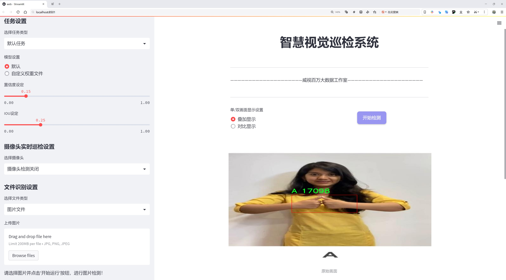
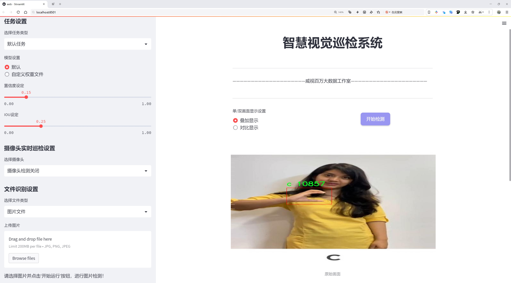
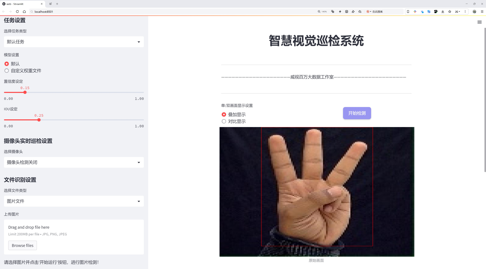
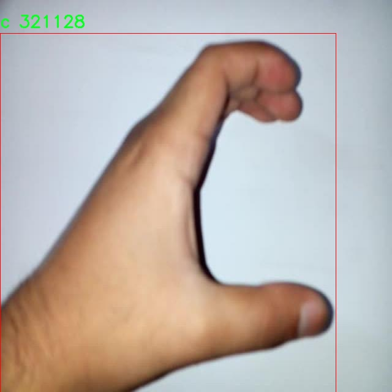
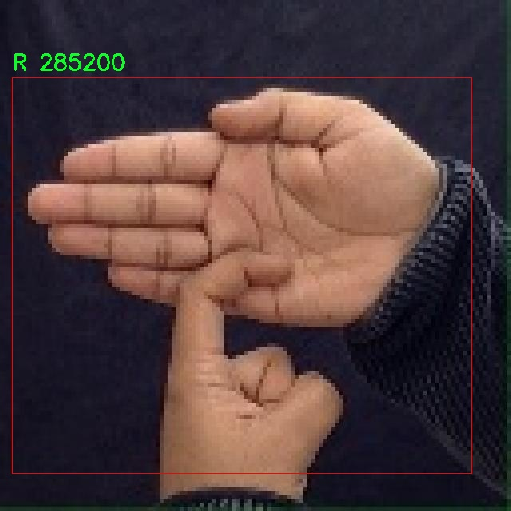
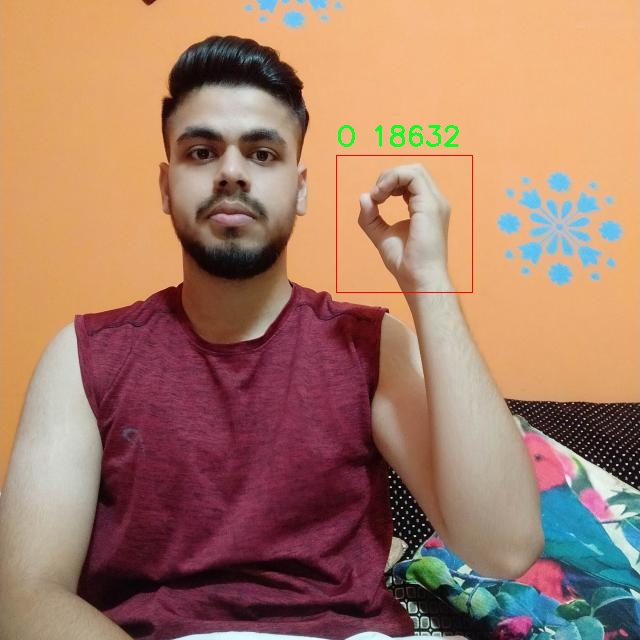
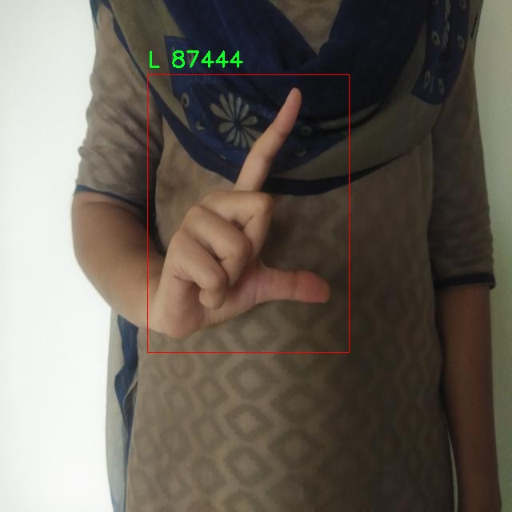
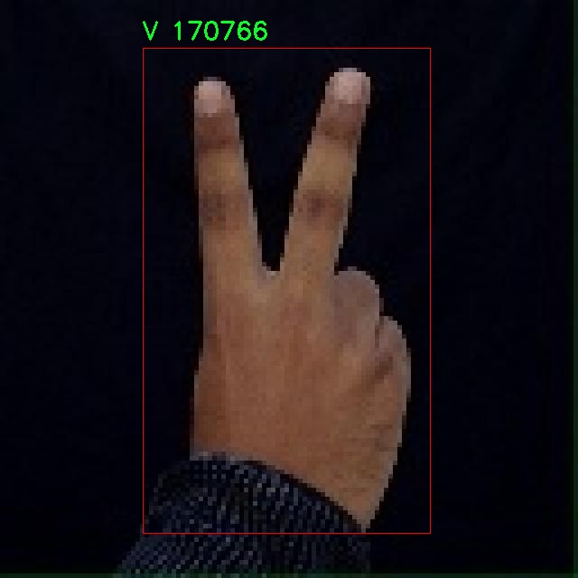

# 手语识别检测系统源码分享
 # [一条龙教学YOLOV8标注好的数据集一键训练_70+全套改进创新点发刊_Web前端展示]

### 1.研究背景与意义

项目参考[AAAI Association for the Advancement of Artificial Intelligence](https://gitee.com/qunshansj/projects)

项目来源[AACV Association for the Advancement of Computer Vision](https://gitee.com/qunmasj/projects)

研究背景与意义

随着信息技术的迅猛发展，手语作为一种重要的非语言交流方式，逐渐受到学术界和社会的广泛关注。手语不仅是聋哑人士沟通的主要工具，也是他们文化认同和社会参与的重要体现。然而，由于手语的复杂性和多样性，传统的手语识别方法往往面临准确性不足和实时性差等问题。因此，开发高效、准确的手语识别系统具有重要的理论和实践意义。

在这一背景下，基于深度学习的目标检测技术逐渐成为手语识别研究的热点。YOLO（You Only Look Once）系列模型因其高效的实时检测能力和较好的准确性，已被广泛应用于各种视觉识别任务。特别是YOLOv8模型，凭借其在特征提取和模型优化方面的优势，展现出了更强的适应性和鲁棒性。因此，基于改进YOLOv8的手语识别系统的研究，能够有效提升手语识别的准确性和实时性，为聋哑人士的日常交流提供更为便捷的技术支持。

本研究所使用的数据集为“印度手语检测”，该数据集包含1748张图像，涵盖35个类别，涉及数字（1-9）和字母（A-Z），以及特定的手势（如C）。这些类别的多样性为手语识别系统的训练提供了丰富的样本，有助于模型学习到更为细致的手势特征。通过对这些手势的准确识别，能够为聋哑人士与社会的互动提供更为自然的交流方式，促进其社会融入和心理健康。

此外，手语识别系统的研究不仅具有技术层面的意义，更具社会价值。通过实现手语与文字、语音之间的实时转换，可以大幅度降低聋哑人士在日常生活、教育和就业等方面的沟通障碍，提升他们的生活质量。同时，该系统的推广应用，也有助于提高社会对手语文化的认知和尊重，推动无障碍环境的建设，促进社会的包容性发展。

在研究过程中，改进YOLOv8模型的具体方法包括优化网络结构、调整超参数以及增强数据集等。通过这些改进，期望能够在保证实时性的前提下，进一步提升手语识别的准确率。此外，研究还将探索如何利用迁移学习等技术，充分利用已有的手语数据，提高模型的学习效率和泛化能力。

综上所述，基于改进YOLOv8的手语识别系统的研究，不仅在技术上具有重要的创新意义，更在社会层面展现出深远的影响。通过这一研究，期望能够为聋哑人士的交流提供更为高效的工具，推动社会对手语文化的理解与接受，最终实现技术与人文的和谐发展。

### 2.图片演示







##### 注意：由于此博客编辑较早，上面“2.图片演示”和“3.视频演示”展示的系统图片或者视频可能为老版本，新版本在老版本的基础上升级如下：（实际效果以升级的新版本为准）

  （1）适配了YOLOV8的“目标检测”模型和“实例分割”模型，通过加载相应的权重（.pt）文件即可自适应加载模型。

  （2）支持“图片识别”、“视频识别”、“摄像头实时识别”三种识别模式。

  （3）支持“图片识别”、“视频识别”、“摄像头实时识别”三种识别结果保存导出，解决手动导出（容易卡顿出现爆内存）存在的问题，识别完自动保存结果并导出到tempDir中。

  （4）支持Web前端系统中的标题、背景图等自定义修改，后面提供修改教程。

  另外本项目提供训练的数据集和训练教程,暂不提供权重文件（best.pt）,需要您按照教程进行训练后实现图片演示和Web前端界面演示的效果。

### 3.视频演示

[3.1 视频演示](https://www.bilibili.com/video/BV1S7tLe9EDD/)

### 4.数据集信息展示

##### 4.1 本项目数据集详细数据（类别数＆类别名）

nc: 35
names: ['1', '2', '3', '4', '5', '6', '7', '8', '9', 'A', 'B', 'D', 'E', 'F', 'G', 'H', 'I', 'J', 'K', 'L', 'M', 'N', 'O', 'P', 'Q', 'R', 'S', 'T', 'U', 'V', 'W', 'X', 'Y', 'Z', 'c']


##### 4.2 本项目数据集信息介绍

数据集信息展示

在本研究中，我们采用了“Indian Sign Language Detection”数据集，以改进YOLOv8手语识别系统。该数据集专为手语识别任务而设计，涵盖了35个类别，具体包括数字和字母的手势，旨在为机器学习模型提供丰富的训练样本，以提高其对印度手语的识别能力。数据集中的类别包括从数字“1”到“9”，以及字母“A”到“Z”，最后还有一个额外的类别“c”，这些类别涵盖了日常交流中常用的手势符号。

该数据集的构建经过精心设计，确保了样本的多样性和代表性。每个类别都包含了大量的手势图像，这些图像在不同的光照条件、背景环境和手势执行者的姿态下进行采集，旨在模拟真实场景中的手语交流。这种多样性不仅提高了模型的泛化能力，还增强了其在实际应用中的鲁棒性。数据集中每个类别的手势图像均经过标注，确保了训练过程中的准确性和有效性。

在手语识别的背景下，准确性和实时性是评估系统性能的关键指标。通过使用“Indian Sign Language Detection”数据集，我们能够为YOLOv8模型提供丰富的训练数据，使其能够在复杂的环境中快速识别和理解手势。这对于聋哑人士与听力正常人士之间的交流至关重要，有助于促进社会的包容性和理解。

数据集的类别设计也具有重要的意义。数字和字母的手势是手语交流的基础，掌握这些基本手势是学习手语的第一步。通过识别这些基础手势，系统可以为用户提供更复杂的手语翻译和理解能力。此外，数据集中包含的“c”类别可能代表了某种特定的手势或符号，这为手语的扩展和深化提供了可能性，进一步丰富了手语的表达方式。

在模型训练过程中，我们将数据集划分为训练集、验证集和测试集，以确保模型在不同阶段的学习和评估。训练集用于模型的学习和参数调整，验证集用于实时监控模型的性能，测试集则用于最终的性能评估。通过这种划分，我们能够有效地避免过拟合现象，确保模型在未见数据上的表现同样出色。

综上所述，“Indian Sign Language Detection”数据集为手语识别系统的训练提供了坚实的基础。通过对该数据集的深入分析和应用，我们期望能够提升YOLOv8在手语识别任务中的性能，使其在实际应用中更具实用性和有效性。这不仅有助于推动手语识别技术的发展，也为促进不同群体之间的沟通与理解奠定了基础。











### 5.全套项目环境部署视频教程（零基础手把手教学）

[5.1 环境部署教程链接（零基础手把手教学）](https://www.ixigua.com/7404473917358506534?logTag=c807d0cbc21c0ef59de5)


[5.2 安装Python虚拟环境创建和依赖库安装视频教程链接（零基础手把手教学）](https://www.ixigua.com/7404474678003106304?logTag=1f1041108cd1f708b01a)

### 6.手把手YOLOV8训练视频教程（零基础小白有手就能学会）

[6.1 手把手YOLOV8训练视频教程（零基础小白有手就能学会）](https://www.ixigua.com/7404477157818401292?logTag=d31a2dfd1983c9668658)

### 7.70+种全套YOLOV8创新点代码加载调参视频教程（一键加载写好的改进模型的配置文件）

[7.1 70+种全套YOLOV8创新点代码加载调参视频教程（一键加载写好的改进模型的配置文件）](https://www.ixigua.com/7404478314661806627?logTag=29066f8288e3f4eea3a4)

### 8.70+种全套YOLOV8创新点原理讲解（非科班也可以轻松写刊发刊，V10版本正在科研待更新）

由于篇幅限制，每个创新点的具体原理讲解就不一一展开，具体见下列网址中的创新点对应子项目的技术原理博客网址【Blog】：


[8.1 70+种全套YOLOV8创新点原理讲解链接](https://gitee.com/qunmasj/good)

### 9.系统功能展示（检测对象为举例，实际内容以本项目数据集为准）

图9.1.系统支持检测结果表格显示

  图9.2.系统支持置信度和IOU阈值手动调节

  图9.3.系统支持自定义加载权重文件best.pt(需要你通过步骤5中训练获得)

  图9.4.系统支持摄像头实时识别

  图9.5.系统支持图片识别

  图9.6.系统支持视频识别

  图9.7.系统支持识别结果文件自动保存

  图9.8.系统支持Excel导出检测结果数据


### 10.原始YOLOV8算法原理

原始YOLOv8算法原理

YOLOv8是2023年1月10日推出的最新一代目标检测算法，标志着YOLO系列模型的又一次重大飞跃。作为计算机视觉领域中用于分类、检测和分割任务的最先进模型，YOLOv8在精度和执行时间方面都显著优于其前辈和其他竞争对手。其设计理念不仅延续了YOLOv5的简洁易用性，还吸收了YOLOv6、YOLOX等模型的优点，形成了一种更为高效的架构。

YOLOv8的核心在于其独特的网络结构，主要由主干网络（backbone）、特征增强网络（neck）和检测头（head）三部分组成。主干网络依然采用了跨阶段局部网络（CSP）的设计理念，这种结构通过分割特征图并在不同阶段进行处理，有效地提高了模型的表达能力和计算效率。在此基础上，YOLOv8对C3模块进行了优化，替换为更加轻量的C2f模块，这一变化不仅减少了计算量，还增强了网络的特征提取能力。

特征增强网络方面，YOLOv8采用了PAN-FPN（路径聚合网络-特征金字塔网络）的思想，旨在更好地融合不同层次的特征信息。通过这种特征融合策略，YOLOv8能够在处理不同尺度的目标时，保持较高的检测精度。此外，YOLOv8在上采样阶段中删除了卷积结构，进一步简化了网络结构，使得模型在保持高效性的同时，减少了计算资源的消耗。

在检测头部分，YOLOv8实现了从耦合头到解耦头的转变。这一创新使得分类和回归任务可以独立进行，从而提高了模型在复杂场景下的定位精度和分类准确性。传统的目标检测方法通常依赖于预定义的锚点框来预测目标的位置，而YOLOv8采用了Anchor-Free的检测方法，直接通过回归方式预测目标的位置和大小。这种方法不仅简化了锚点框的选择和调整过程，还使得模型能够更快地聚焦于目标位置的邻近点，进而提高了预测框与实际边界框的重合度。

YOLOv8的损失函数设计也进行了创新，采用了变焦损失计算分类损失，并结合数据平均保真度损失和完美交并比损失来计算边界框损失。这种新颖的损失策略使得YOLOv8在训练过程中能够更好地平衡分类和定位的精度，从而提升了整体的检测性能。

在具体应用中，YOLOv8展现出了卓越的性能，尤其是在小目标检测和高分辨率图像处理方面。其轻量化的模型权重使得YOLOv8能够在各种硬件平台上高效运行，从CPU到GPU的广泛兼容性使得该模型能够满足实时检测的需求，适用于嵌入式设备和移动端应用。

通过与YOLOv5在COCOVal2017数据集上的对比，YOLOv8在每张图的识别准确性和训练速度上均取得了显著的提升。这一切都表明，YOLOv8不仅在理论上进行了深入的探索，更在实践中展现出了强大的实用性和灵活性。

综上所述，YOLOv8作为YOLO系列的最新进展，凭借其创新的网络结构、优化的特征融合方法、解耦的检测头以及先进的损失函数设计，成功地提升了目标检测的效率和准确性。它的推出不仅为计算机视觉领域带来了新的技术突破，也为后续的研究和应用提供了丰富的思路和借鉴。随着YOLOv8的广泛应用，未来的目标检测任务将会更加高效、准确，推动智能视觉技术的进一步发展。


### 11.项目核心源码讲解（再也不用担心看不懂代码逻辑）

#### 11.1 code\ultralytics\cfg\__init__.py

以下是代码中最核心的部分，并附上详细的中文注释：

```python
import sys
from pathlib import Path
from types import SimpleNamespace
from typing import Dict, Union

# 定义有效的任务和模式
MODES = "train", "val", "predict", "export", "track", "benchmark"
TASKS = "detect", "segment", "classify", "pose", "obb"

# 任务与数据集、模型、指标的映射
TASK2DATA = {
    "detect": "coco8.yaml",
    "segment": "coco8-seg.yaml",
    "classify": "imagenet10",
    "pose": "coco8-pose.yaml",
    "obb": "dota8.yaml",
}
TASK2MODEL = {
    "detect": "yolov8n.pt",
    "segment": "yolov8n-seg.pt",
    "classify": "yolov8n-cls.pt",
    "pose": "yolov8n-pose.pt",
    "obb": "yolov8n-obb.pt",
}
TASK2METRIC = {
    "detect": "metrics/mAP50-95(B)",
    "segment": "metrics/mAP50-95(M)",
    "classify": "metrics/accuracy_top1",
    "pose": "metrics/mAP50-95(P)",
    "obb": "metrics/mAP50-95(OBB)",
}

def cfg2dict(cfg):
    """
    将配置对象转换为字典格式，支持文件路径、字符串或SimpleNamespace对象。

    Args:
        cfg (str | Path | dict | SimpleNamespace): 要转换的配置对象。

    Returns:
        cfg (dict): 转换后的字典格式配置对象。
    """
    if isinstance(cfg, (str, Path)):
        cfg = yaml_load(cfg)  # 从文件加载字典
    elif isinstance(cfg, SimpleNamespace):
        cfg = vars(cfg)  # 转换为字典
    return cfg

def get_cfg(cfg: Union[str, Path, Dict, SimpleNamespace] = DEFAULT_CFG_DICT, overrides: Dict = None):
    """
    从文件或字典加载并合并配置数据。

    Args:
        cfg (str | Path | Dict | SimpleNamespace): 配置数据。
        overrides (str | Dict | optional): 覆盖的配置，可以是文件名或字典。默认为None。

    Returns:
        (SimpleNamespace): 训练参数的命名空间。
    """
    cfg = cfg2dict(cfg)

    # 合并覆盖配置
    if overrides:
        overrides = cfg2dict(overrides)
        cfg = {**cfg, **overrides}  # 合并cfg和覆盖字典（优先使用覆盖）

    # 类型和值检查
    for k, v in cfg.items():
        if v is not None:  # None值可能来自可选参数
            if k in CFG_FLOAT_KEYS and not isinstance(v, (int, float)):
                raise TypeError(f"'{k}={v}' 的类型无效，必须是 int 或 float")
            elif k in CFG_INT_KEYS and not isinstance(v, int):
                raise TypeError(f"'{k}={v}' 的类型无效，必须是 int")
            elif k in CFG_BOOL_KEYS and not isinstance(v, bool):
                raise TypeError(f"'{k}={v}' 的类型无效，必须是 bool")

    # 返回配置实例
    return IterableSimpleNamespace(**cfg)

def entrypoint(debug=""):
    """
    该函数是Ultralytics包的入口，负责解析传递给包的命令行参数。

    允许：
    - 传递必需的YOLO参数
    - 指定要执行的任务（detect、segment、classify等）
    - 指定模式（train、val、predict等）
    - 运行特殊模式（如checks）
    - 传递覆盖配置

    使用包的默认配置并初始化传递的覆盖配置。
    """
    args = (debug.split(" ") if debug else sys.argv)[1:]
    if not args:  # 没有传递参数
        LOGGER.info(CLI_HELP_MSG)
        return

    overrides = {}  # 基本覆盖配置
    for a in args:
        if "=" in a:
            k, v = a.split("=", 1)  # 解析key=value对
            overrides[k] = v
        elif a in TASKS:
            overrides["task"] = a
        elif a in MODES:
            overrides["mode"] = a

    # 检查并获取配置
    cfg = get_cfg(overrides=overrides)

    # 根据模式执行相应的操作
    mode = overrides.get("mode", "predict")
    task = overrides.get("task", None)

    # 这里可以添加更多的模式处理逻辑
    # 例如：训练、验证、预测等

    # 运行模型
    model = YOLO(cfg.model, task=task)  # 创建YOLO模型实例
    getattr(model, mode)(**overrides)  # 调用相应的模式方法

if __name__ == "__main__":
    entrypoint(debug="")
```

### 代码分析
1. **模块导入**：导入必要的模块和库，包括系统模块、路径处理模块和类型注解模块。
2. **常量定义**：定义了有效的任务和模式，以及任务与数据集、模型、指标的映射关系。
3. **配置转换函数**：`cfg2dict`函数用于将不同格式的配置转换为字典格式，方便后续处理。
4. **获取配置函数**：`get_cfg`函数用于加载和合并配置，支持从文件、字典或命名空间中获取配置，并进行类型和值的检查。
5. **入口函数**：`entrypoint`函数是程序的主入口，负责解析命令行参数，获取配置，并根据指定的模式执行相应的操作。

以上是代码的核心部分和详细注释，提供了对Ultralytics YOLO框架的基本理解和使用方式。

这个文件是Ultralytics YOLO项目的配置模块，主要用于处理YOLO模型的配置和命令行接口（CLI）参数。文件开头包含了一些必要的库导入，包括路径处理、类型定义和一些工具函数。接下来定义了一些有效的任务和模式，任务包括检测、分割、分类、姿态估计和有界框（obb），而模式则包括训练、验证、预测、导出、跟踪和基准测试。

文件中定义了多个字典，将任务映射到相应的数据集、模型和评估指标。例如，检测任务对应的数据集是“coco8.yaml”，模型是“yolov8n.pt”，评估指标是“metrics/mAP50-95(B)”。这些映射关系有助于简化模型的使用。

CLI帮助信息被定义为一个多行字符串，提供了如何使用YOLO命令的示例，包括训练模型、进行预测、验证模型等。用户可以通过命令行传递参数，来执行不同的任务和模式。

接下来，文件定义了一些用于参数类型检查的键，包括浮点数、整数和布尔值的键。这些键在后续的配置加载和合并过程中会被用来验证用户输入的参数类型是否正确。

`cfg2dict`函数用于将配置对象转换为字典格式，支持文件路径、字符串、字典和SimpleNamespace对象。`get_cfg`函数则用于加载和合并配置数据，支持从文件或字典中读取配置，并允许用户覆盖默认配置。

`get_save_dir`函数根据训练、验证或预测的参数返回保存目录。`_handle_deprecation`函数处理过时的配置键，确保向后兼容性。`check_dict_alignment`函数检查自定义配置与基础配置之间的键是否匹配，若不匹配则提供相似的键提示并退出程序。

`merge_equals_args`函数用于合并参数列表中的等号参数，确保参数格式正确。`handle_yolo_hub`和`handle_yolo_settings`函数分别处理与Ultralytics HUB和YOLO设置相关的命令行参数。

`entrypoint`函数是该模块的入口点，负责解析传递给包的命令行参数。它允许用户指定任务、模式以及覆盖默认配置的参数。根据解析的参数，函数会创建相应的模型实例并调用相应的模式方法。

最后，文件还定义了一个`copy_default_cfg`函数，用于复制默认配置文件并创建一个新的配置文件，方便用户进行自定义设置。

总的来说，这个文件为YOLO模型的使用提供了灵活的配置管理和命令行接口，方便用户根据自己的需求进行模型训练、验证和预测等操作。

#### 11.2 ui.py

以下是代码中最核心的部分，并附上详细的中文注释：

```python
import sys
import subprocess

def run_script(script_path):
    """
    使用当前 Python 环境运行指定的脚本。

    Args:
        script_path (str): 要运行的脚本路径

    Returns:
        None
    """
    # 获取当前 Python 解释器的路径
    python_path = sys.executable

    # 构建运行命令，使用 streamlit 运行指定的脚本
    command = f'"{python_path}" -m streamlit run "{script_path}"'

    # 执行命令
    result = subprocess.run(command, shell=True)
    # 检查命令执行的返回码，如果不为0，表示执行出错
    if result.returncode != 0:
        print("脚本运行出错。")

# 实例化并运行应用
if __name__ == "__main__":
    # 指定要运行的脚本路径
    script_path = "web.py"  # 这里可以直接指定脚本名

    # 调用函数运行脚本
    run_script(script_path)
```

### 代码注释说明：
1. **导入模块**：
   - `sys`：用于访问与 Python 解释器相关的变量和函数。
   - `subprocess`：用于执行外部命令和与其交互。

2. **定义 `run_script` 函数**：
   - 该函数接受一个参数 `script_path`，表示要运行的 Python 脚本的路径。
   - 使用 `sys.executable` 获取当前 Python 解释器的路径，以确保在当前环境中运行脚本。
   - 构建命令字符串，使用 `streamlit` 模块运行指定的脚本。
   - 使用 `subprocess.run` 执行构建的命令，并检查返回码以判断脚本是否成功运行。

3. **主程序入口**：
   - 使用 `if __name__ == "__main__":` 确保只有在直接运行该脚本时才会执行以下代码。
   - 指定要运行的脚本路径（这里是 `web.py`）。
   - 调用 `run_script` 函数来执行指定的脚本。

这个程序文件名为 `ui.py`，其主要功能是使用当前的 Python 环境来运行一个指定的脚本。代码中首先导入了必要的模块，包括 `sys`、`os` 和 `subprocess`，以及一个自定义的路径处理模块 `abs_path`。

在 `run_script` 函数中，首先获取当前 Python 解释器的路径，这样可以确保在正确的环境中运行脚本。接着，构建一个命令字符串，该命令使用 `streamlit` 模块来运行指定的脚本。`streamlit` 是一个用于构建数据应用的库，命令格式为 `python -m streamlit run script_path`。

然后，使用 `subprocess.run` 方法执行这个命令。该方法会在一个新的 shell 中运行命令，并返回一个结果对象。通过检查 `result.returncode`，可以判断脚本是否成功运行。如果返回码不为零，表示运行出错，程序会打印出相应的错误信息。

在文件的最后部分，使用 `if __name__ == "__main__":` 来确保只有在直接运行该脚本时才会执行后面的代码。这里指定了要运行的脚本路径为 `web.py`，并调用 `run_script` 函数来执行这个脚本。

总的来说，这个程序的主要作用是提供一个简单的接口，通过命令行来运行一个 Streamlit 应用，便于开发和测试。

#### 11.3 70+种YOLOv8算法改进源码大全和调试加载训练教程（非必要）\ultralytics\nn\extra_modules\__init__.py

以下是代码中最核心的部分，并对其进行了详细的中文注释：

```python
# 导入模块
# 从当前包中导入各个模块，以下是各个模块的功能简要说明：

from .afpn import *  # 导入自适应特征金字塔网络（AFPN）相关的功能
from .attention import *  # 导入注意力机制相关的功能
from .block import *  # 导入基本网络块的定义
from .head import *  # 导入网络头部的定义，通常用于输出层
from .rep_block import *  # 导入重复块的定义，可能用于构建深层网络
from .kernel_warehouse import *  # 导入内核仓库的功能，可能用于管理卷积核
from .dynamic_snake_conv import *  # 导入动态蛇形卷积的实现
from .orepa import *  # 导入OREPA（可能是某种特定的网络结构或算法）
from .RFAConv import *  # 导入RFA卷积（可能是某种改进的卷积方法）

# 以上导入语句将各个模块的功能引入当前命名空间，便于后续使用。
```

在这个代码片段中，主要的功能是将不同的模块导入到当前的命名空间中，以便后续可以使用这些模块中定义的类和函数。每个模块的名称暗示了其可能的功能，通常用于构建深度学习模型的不同组件。

这个程序文件是一个Python模块的初始化文件，位于YOLOv8算法改进源码的目录结构中。文件名表明它与YOLOv8的改进算法和训练调试相关。文件中的代码主要是导入其他模块或类，以便在当前模块中使用。

具体来说，文件通过`from .module_name import *`的方式，导入了多个子模块。这些子模块包括：

1. `afpn`：可能与特征金字塔网络（FPN）相关，用于增强特征提取。
2. `attention`：可能实现了注意力机制，用于提升模型对重要特征的关注。
3. `block`：可能定义了基本的网络结构模块。
4. `head`：通常指网络的输出部分，负责将特征映射转换为最终的预测结果。
5. `rep_block`：可能是重复使用的网络块，常用于构建深层网络。
6. `kernel_warehouse`：可能涉及到卷积核的管理或优化。
7. `dynamic_snake_conv`：可能是动态卷积的实现，增强模型的灵活性。
8. `orepa`：具体功能不明，可能是某种优化或改进算法。
9. `RFAConv`：可能是某种特定类型的卷积操作，可能与特征融合或注意力机制相关。

通过这些导入，用户可以在使用该模块时，直接调用这些子模块中的功能，而无需单独导入每一个模块。这种做法有助于提高代码的可读性和组织性，使得整个YOLOv8算法的实现更加模块化和易于维护。

#### 11.4 train.py

以下是代码中最核心的部分，并附上详细的中文注释：

```python
class DetectionTrainer(BaseTrainer):
    """
    DetectionTrainer类，继承自BaseTrainer类，用于基于检测模型的训练。
    """

    def build_dataset(self, img_path, mode="train", batch=None):
        """
        构建YOLO数据集。

        参数:
            img_path (str): 包含图像的文件夹路径。
            mode (str): 模式，可以是'train'或'val'，用户可以为每种模式自定义不同的增强。
            batch (int, optional): 批次大小，仅用于'rect'模式。默认为None。
        """
        gs = max(int(de_parallel(self.model).stride.max() if self.model else 0), 32)
        return build_yolo_dataset(self.args, img_path, batch, self.data, mode=mode, rect=mode == "val", stride=gs)

    def get_dataloader(self, dataset_path, batch_size=16, rank=0, mode="train"):
        """构造并返回数据加载器。"""
        assert mode in ["train", "val"]  # 确保模式有效
        with torch_distributed_zero_first(rank):  # 在分布式环境中，确保数据集只初始化一次
            dataset = self.build_dataset(dataset_path, mode, batch_size)  # 构建数据集
        shuffle = mode == "train"  # 训练模式下打乱数据
        if getattr(dataset, "rect", False) and shuffle:
            LOGGER.warning("WARNING ⚠️ 'rect=True'与DataLoader的shuffle不兼容，设置shuffle=False")
            shuffle = False
        workers = self.args.workers if mode == "train" else self.args.workers * 2  # 根据模式设置工作线程数
        return build_dataloader(dataset, batch_size, workers, shuffle, rank)  # 返回数据加载器

    def preprocess_batch(self, batch):
        """对一批图像进行预处理，包括缩放和转换为浮点数。"""
        batch["img"] = batch["img"].to(self.device, non_blocking=True).float() / 255  # 将图像转移到设备并归一化
        if self.args.multi_scale:  # 如果启用多尺度
            imgs = batch["img"]
            sz = (
                random.randrange(self.args.imgsz * 0.5, self.args.imgsz * 1.5 + self.stride)
                // self.stride
                * self.stride
            )  # 随机选择新的尺寸
            sf = sz / max(imgs.shape[2:])  # 计算缩放因子
            if sf != 1:
                ns = [
                    math.ceil(x * sf / self.stride) * self.stride for x in imgs.shape[2:]
                ]  # 计算新的形状
                imgs = nn.functional.interpolate(imgs, size=ns, mode="bilinear", align_corners=False)  # 进行插值
            batch["img"] = imgs  # 更新批次图像
        return batch

    def get_model(self, cfg=None, weights=None, verbose=True):
        """返回YOLO检测模型。"""
        model = DetectionModel(cfg, nc=self.data["nc"], verbose=verbose and RANK == -1)  # 创建检测模型
        if weights:
            model.load(weights)  # 加载权重
        return model

    def get_validator(self):
        """返回用于YOLO模型验证的DetectionValidator。"""
        self.loss_names = "box_loss", "cls_loss", "dfl_loss"  # 定义损失名称
        return yolo.detect.DetectionValidator(
            self.test_loader, save_dir=self.save_dir, args=copy(self.args), _callbacks=self.callbacks
        )  # 返回验证器

    def plot_training_samples(self, batch, ni):
        """绘制带有注释的训练样本。"""
        plot_images(
            images=batch["img"],
            batch_idx=batch["batch_idx"],
            cls=batch["cls"].squeeze(-1),
            bboxes=batch["bboxes"],
            paths=batch["im_file"],
            fname=self.save_dir / f"train_batch{ni}.jpg",
            on_plot=self.on_plot,
        )  # 绘制图像并保存

    def plot_metrics(self):
        """从CSV文件中绘制指标。"""
        plot_results(file=self.csv, on_plot=self.on_plot)  # 保存结果图像
```

### 代码核心部分说明：
1. **DetectionTrainer类**：这是一个用于训练YOLO检测模型的类，继承自基础训练类`BaseTrainer`。
2. **build_dataset方法**：构建YOLO数据集，接受图像路径、模式和批次大小作为参数。
3. **get_dataloader方法**：构造数据加载器，支持训练和验证模式，并根据模式设置数据打乱和工作线程数。
4. **preprocess_batch方法**：对输入的图像批次进行预处理，包括归一化和可能的缩放。
5. **get_model方法**：返回一个YOLO检测模型，并可以加载预训练权重。
6. **get_validator方法**：返回一个用于模型验证的验证器。
7. **plot_training_samples和plot_metrics方法**：用于可视化训练样本和训练指标。

这个程序文件 `train.py` 是一个用于训练目标检测模型的脚本，主要基于 YOLO（You Only Look Once）架构。文件中定义了一个名为 `DetectionTrainer` 的类，该类继承自 `BaseTrainer`，并提供了一系列方法来构建数据集、加载数据、预处理图像、设置模型属性、获取模型、验证模型、记录损失、绘制训练样本和指标等。

在 `DetectionTrainer` 类中，`build_dataset` 方法用于构建 YOLO 数据集。它接收图像路径、模式（训练或验证）和批量大小作为参数，并根据模型的步幅（stride）构建数据集。`get_dataloader` 方法则负责创建数据加载器，确保在分布式训练时只初始化一次数据集，并根据模式决定是否打乱数据。

`preprocess_batch` 方法对输入的图像批次进行预处理，包括将图像缩放到合适的大小并转换为浮点数。这个过程还支持多尺度训练，通过随机选择图像大小来增强模型的鲁棒性。

`set_model_attributes` 方法用于设置模型的属性，包括类别数量和类别名称等。`get_model` 方法返回一个 YOLO 检测模型实例，并可以加载预训练权重。

`get_validator` 方法返回一个用于验证模型的 `DetectionValidator` 实例。`label_loss_items` 方法则用于生成一个包含训练损失项的字典，便于记录和分析训练过程中的损失。

`progress_string` 方法返回一个格式化的字符串，显示训练进度，包括当前的 epoch、GPU 内存使用情况、损失值、实例数量和图像大小等信息。

`plot_training_samples` 方法用于绘制训练样本及其标注，便于可视化训练过程中的数据。`plot_metrics` 和 `plot_training_labels` 方法则分别用于绘制训练指标和创建带标签的训练图，以便分析模型的表现。

整体来看，这个文件提供了一个结构化的框架，用于训练 YOLO 模型，支持多种功能以便于用户进行模型训练、验证和结果分析。

#### 11.5 70+种YOLOv8算法改进源码大全和调试加载训练教程（非必要）\ultralytics\nn\autobackend.py

以下是经过简化和注释的核心代码部分，主要关注 `AutoBackend` 类及其初始化和推理方法：

```python
import torch
import torch.nn as nn
from ultralytics.utils import LOGGER, yaml_load

class AutoBackend(nn.Module):
    """
    处理 Ultralytics YOLO 模型的动态后端选择以进行推理。
    """

    @torch.no_grad()
    def __init__(self, weights='yolov8n.pt', device=torch.device('cpu'), fp16=False, fuse=True, data=None):
        """
        初始化 AutoBackend 以进行推理。

        参数:
            weights (str): 模型权重文件的路径，默认为 'yolov8n.pt'。
            device (torch.device): 运行模型的设备，默认为 CPU。
            fp16 (bool): 启用半精度推理，仅在特定后端支持。默认为 False。
            fuse (bool): 融合 Conv2D + BatchNorm 层以优化，默认为 True。
            data (str | Path | optional): 包含类名的额外 data.yaml 文件的路径，可选。
        """
        super().__init__()
        # 处理权重文件路径
        w = str(weights[0] if isinstance(weights, list) else weights)
        pt = self._model_type(w)[0]  # 检查模型类型是否为 PyTorch

        # 设置设备
        cuda = torch.cuda.is_available() and device.type != 'cpu'
        if cuda and not pt:  # 如果没有使用 PyTorch 模型，则强制使用 CPU
            device = torch.device('cpu')
            cuda = False

        # 加载模型
        if pt:  # 如果是 PyTorch 模型
            from ultralytics.nn.tasks import attempt_load_weights
            self.model = attempt_load_weights(w, device=device, inplace=True, fuse=fuse)
            self.model.half() if fp16 else self.model.float()  # 根据 fp16 设置模型精度
        else:
            raise TypeError(f"model='{w}' is not a supported model format.")

        # 加载类名
        self.names = self._apply_default_class_names(data)

    def forward(self, im):
        """
        在 YOLOv8 MultiBackend 模型上运行推理。

        参数:
            im (torch.Tensor): 要进行推理的图像张量。

        返回:
            (torch.Tensor): 推理结果的张量。
        """
        # 确保输入图像是正确的格式
        if self.fp16 and im.dtype != torch.float16:
            im = im.half()  # 转换为 FP16

        # 使用 PyTorch 模型进行推理
        y = self.model(im)  # 直接调用模型进行推理
        return y

    @staticmethod
    def _apply_default_class_names(data):
        """应用默认类名到输入的 YAML 文件或返回数字类名。"""
        return yaml_load(data)['names'] if data else {i: f'class{i}' for i in range(999)}  # 返回默认类名

    @staticmethod
    def _model_type(p='path/to/model.pt'):
        """
        根据模型文件路径返回模型类型。

        参数:
            p: 模型文件的路径，默认为 'path/to/model.pt'
        """
        # 这里省略了具体的实现，返回一个布尔值列表，指示模型类型
        return [True]  # 假设返回 PyTorch 模型类型为 True
```

### 代码注释说明
1. **类 `AutoBackend`**: 该类用于动态选择后端以进行 YOLO 模型的推理，支持多种模型格式。
2. **`__init__` 方法**: 初始化模型，加载权重文件并设置设备和精度。根据输入的权重文件类型加载相应的模型。
3. **`forward` 方法**: 接收输入图像，进行推理并返回结果。支持将输入图像转换为半精度。
4. **`_apply_default_class_names` 方法**: 加载类名，如果没有提供则返回默认的类名。
5. **`_model_type` 方法**: 检查模型文件的类型，返回相应的布尔值。

这个简化版本保留了核心功能和结构，同时添加了详细的中文注释，以帮助理解代码的作用和逻辑。

这个程序文件是Ultralytics YOLO（You Only Look Once）模型的一个重要组成部分，主要负责动态选择后端以进行推理。它的核心功能是根据输入模型的格式，自动加载和配置不同的推理引擎，从而支持多种模型格式的推理。以下是对代码的详细讲解。

首先，文件引入了一些必要的库，包括标准库和第三方库，如`torch`、`cv2`、`numpy`等。这些库为模型的加载、处理和推理提供了支持。

接下来，定义了一个`check_class_names`函数，用于检查和处理类名。该函数可以将类名从列表转换为字典，并确保类名的索引是有效的，适用于YOLO模型的多类检测任务。

然后，定义了`AutoBackend`类，它继承自`torch.nn.Module`。这个类的构造函数接受多个参数，包括模型权重路径、设备类型、是否使用DNN模块、数据配置文件等。构造函数中首先会根据输入的模型权重路径判断模型的类型，并进行相应的加载。支持的模型格式包括PyTorch、TorchScript、ONNX、OpenVINO、TensorRT等。

在模型加载过程中，程序会根据设备的可用性（如CUDA）选择合适的运行环境，并在必要时下载模型文件。对于不同的模型格式，使用不同的方法进行加载。例如，对于PyTorch模型，使用`attempt_load_weights`函数；对于ONNX模型，使用`cv2.dnn.readNetFromONNX`等。

加载模型后，程序会读取模型的元数据，如模型的输入输出形状、类别名称等，并进行必要的检查。如果未提供类别名称，程序会尝试从数据配置文件中加载默认的类别名称。

在`forward`方法中，程序实现了模型的推理过程。该方法接受一个图像张量作为输入，并根据模型的类型执行推理。支持的推理方式包括直接调用PyTorch模型、使用ONNX Runtime、OpenVINO、TensorRT等。根据输入的图像格式，程序会进行必要的形状转换和数据类型处理。

此外，`warmup`方法用于预热模型，通过运行一次前向推理来提高后续推理的速度。`_apply_default_class_names`和`_model_type`是一些静态方法，用于处理类名和模型类型的识别。

总的来说，这个文件实现了YOLOv8模型的后端动态选择和推理，具有良好的灵活性和扩展性，能够支持多种模型格式和推理引擎，方便用户在不同的环境中使用YOLO模型进行目标检测任务。

#### 11.6 70+种YOLOv8算法改进源码大全和调试加载训练教程（非必要）\ultralytics\models\sam\predict.py

以下是代码中最核心的部分，并附上详细的中文注释：

```python
class Predictor(BasePredictor):
    """
    Predictor类用于Segment Anything Model (SAM)，继承自BasePredictor。

    该类提供了一个接口，用于图像分割任务的模型推理。
    通过先进的架构和可提示的分割能力，它支持灵活和实时的掩码生成。
    """

    def __init__(self, cfg=DEFAULT_CFG, overrides=None, _callbacks=None):
        """
        初始化Predictor，设置配置、覆盖和回调。

        Args:
            cfg (dict): 配置字典。
            overrides (dict, optional): 覆盖默认配置的值的字典。
            _callbacks (dict, optional): 自定义行为的回调函数字典。
        """
        if overrides is None:
            overrides = {}
        overrides.update(dict(task='segment', mode='predict', imgsz=1024))
        super().__init__(cfg, overrides, _callbacks)
        self.args.retina_masks = True  # 启用视网膜掩码
        self.im = None  # 输入图像
        self.features = None  # 提取的图像特征
        self.prompts = {}  # 存储各种提示类型
        self.segment_all = False  # 控制是否分割所有对象的标志

    def preprocess(self, im):
        """
        预处理输入图像以进行模型推理。

        Args:
            im (torch.Tensor | List[np.ndarray]): BCHW张量格式或HWC numpy数组列表。

        Returns:
            (torch.Tensor): 预处理后的图像张量。
        """
        if self.im is not None:
            return self.im  # 如果已经处理过，直接返回
        not_tensor = not isinstance(im, torch.Tensor)
        if not_tensor:
            im = np.stack(self.pre_transform(im))  # 预处理图像
            im = im[..., ::-1].transpose((0, 3, 1, 2))  # 转换通道顺序
            im = np.ascontiguousarray(im)
            im = torch.from_numpy(im)  # 转换为张量

        im = im.to(self.device)  # 将图像移动到设备上
        im = im.half() if self.model.fp16 else im.float()  # 根据模型精度转换
        if not_tensor:
            im = (im - self.mean) / self.std  # 归一化处理
        return im

    def inference(self, im, bboxes=None, points=None, labels=None, masks=None, multimask_output=False, *args, **kwargs):
        """
        基于给定的输入提示执行图像分割推理。

        Args:
            im (torch.Tensor): 预处理后的输入图像张量，形状为(N, C, H, W)。
            bboxes (np.ndarray | List, optional): 边界框，形状为(N, 4)，XYXY格式。
            points (np.ndarray | List, optional): 指示对象位置的点，形状为(N, 2)，像素坐标。
            labels (np.ndarray | List, optional): 点提示的标签，形状为(N, )。1表示前景，0表示背景。
            masks (np.ndarray, optional): 先前预测的低分辨率掩码，形状应为(N, H, W)。
            multimask_output (bool, optional): 返回多个掩码的标志。对于模糊提示有帮助。默认为False。

        Returns:
            (tuple): 包含以下三个元素的元组。
                - np.ndarray: 输出掩码，形状为CxHxW，其中C是生成的掩码数量。
                - np.ndarray: 长度为C的数组，包含模型为每个掩码预测的质量分数。
                - np.ndarray: 形状为CxHxW的低分辨率logits，用于后续推理。
        """
        # 从self.prompts中提取提示
        bboxes = self.prompts.pop('bboxes', bboxes)
        points = self.prompts.pop('points', points)
        masks = self.prompts.pop('masks', masks)

        if all(i is None for i in [bboxes, points, masks]):
            return self.generate(im, *args, **kwargs)  # 如果没有提示，生成掩码

        return self.prompt_inference(im, bboxes, points, labels, masks, multimask_output)  # 使用提示进行推理

    def generate(self, im, crop_n_layers=0, crop_overlap_ratio=512 / 1500, crop_downscale_factor=1,
                 points_stride=32, points_batch_size=64, conf_thres=0.88, stability_score_thresh=0.95,
                 stability_score_offset=0.95, crop_nms_thresh=0.7):
        """
        使用Segment Anything Model (SAM)执行图像分割。

        Args:
            im (torch.Tensor): 输入张量，表示预处理后的图像，维度为(N, C, H, W)。
            crop_n_layers (int): 指定用于图像裁剪的层数。
            crop_overlap_ratio (float): 裁剪之间的重叠比例。
            points_stride (int, optional): 沿图像每边采样的点数。
            points_batch_size (int): 同时处理的点的批量大小。
            conf_thres (float): 基于模型掩码质量预测的置信度阈值。
            stability_score_thresh (float): 基于掩码稳定性的过滤阈值。

        Returns:
            (tuple): 包含分割掩码、置信度分数和边界框的元组。
        """
        self.segment_all = True  # 设置为分割所有对象
        ih, iw = im.shape[2:]  # 获取输入图像的高度和宽度
        crop_regions, layer_idxs = generate_crop_boxes((ih, iw), crop_n_layers, crop_overlap_ratio)  # 生成裁剪区域
        pred_masks, pred_scores, pred_bboxes, region_areas = [], [], [], []  # 初始化预测结果

        for crop_region, layer_idx in zip(crop_regions, layer_idxs):
            x1, y1, x2, y2 = crop_region  # 获取裁剪区域的坐标
            crop_im = F.interpolate(im[..., y1:y2, x1:x2], (ih, iw), mode='bilinear', align_corners=False)  # 裁剪并插值
            # 进行推理
            crop_masks, crop_scores, crop_bboxes = self.prompt_inference(crop_im, points=points, multimask_output=True)

            # 后处理，合并掩码和边界框
            pred_masks.append(crop_masks)
            pred_bboxes.append(crop_bboxes)
            pred_scores.append(crop_scores)

        # 合并所有预测结果
        pred_masks = torch.cat(pred_masks)
        pred_bboxes = torch.cat(pred_bboxes)
        pred_scores = torch.cat(pred_scores)

        return pred_masks, pred_scores, pred_bboxes  # 返回最终的掩码、分数和边界框
```

### 代码核心部分说明：
1. **Predictor类**：这是进行图像分割的主要类，继承自`BasePredictor`，提供了推理的接口。
2. **初始化方法**：设置模型的配置、覆盖和回调，初始化输入图像和特征。
3. **预处理方法**：对输入图像进行处理，包括转换为张量、归一化等。
4. **推理方法**：根据输入的提示（如边界框、点等）进行图像分割推理。
5. **生成方法**：执行图像分割，支持裁剪和重叠区域的处理，返回最终的掩码和边界框。

以上是代码的核心部分及其详细注释，帮助理解其功能和实现逻辑。

这个程序文件是Ultralytics YOLO框架中的一个模块，主要用于实现Segment Anything Model（SAM）的图像分割预测功能。SAM是一种先进的图像分割模型，具有可提示分割和零-shot性能的特点。该模块包含了执行分割所需的预测逻辑和辅助工具，旨在高性能、实时的图像分割任务中使用。

文件首先导入了一些必要的库，包括NumPy、PyTorch及其功能模块、TorchVision等。接着，它定义了一个名为`Predictor`的类，该类继承自`BasePredictor`，并为图像分割任务提供了一个接口。`Predictor`类的构造函数初始化了一些属性，包括配置字典、覆盖的参数、回调函数等，并设置了一些特定于任务的设置，如`retina_masks`。

在`Predictor`类中，有多个方法用于处理图像和执行推理。`preprocess`方法负责对输入图像进行预处理，包括转换为张量格式、归一化等。`pre_transform`方法则执行初步的图像变换，主要是调整图像大小以适应模型输入。

`inference`方法是进行图像分割推理的核心，接收预处理后的图像和各种提示（如边界框、点、掩码等），并根据这些提示进行分割。`prompt_inference`方法是一个内部函数，专门处理基于提示的推理。

`generate`方法则实现了对整个图像的分割，利用SAM的架构和实时性能，能够对图像进行细致的分割处理。它支持对图像进行裁剪，以便在更小的区域内进行更精确的分割。

`setup_model`方法用于初始化SAM模型，配置设备、图像归一化参数等。`postprocess`方法则对模型的输出进行后处理，生成最终的检测掩码和边界框。

此外，`setup_source`和`set_image`方法用于配置数据源和设置待处理的图像。`set_prompts`方法允许用户提前设置提示，而`reset_image`方法则重置图像和特征。

最后，`remove_small_regions`方法用于对生成的分割掩码进行后处理，移除小的、不连通的区域和孔洞，并通过非极大值抑制（NMS）去除重复的边界框。

总体来说，这个文件实现了一个灵活且高效的图像分割预测工具，能够处理多种输入形式并提供实时的分割结果，适用于各种计算机视觉任务。

### 12.系统整体结构（节选）

### 整体功能和构架概括

Ultralytics YOLOv8项目是一个基于YOLO（You Only Look Once）架构的目标检测和图像分割框架，旨在提供高效、灵活的模型训练和推理功能。该项目的构架由多个模块组成，每个模块负责特定的功能，包括模型配置、训练、推理、数据处理和后处理等。通过模块化设计，用户可以根据需求灵活地使用和扩展不同的功能。

主要功能模块包括：

1. **配置管理**：通过`cfg/__init__.py`管理模型的配置和命令行参数。
2. **训练管理**：`train.py`提供了训练模型的框架，支持数据加载、模型训练和损失记录。
3. **推理和预测**：多个推理模块（如`predict.py`）实现了对图像的实时分割和检测。
4. **后端管理**：`autobackend.py`负责动态选择推理后端，支持多种模型格式。
5. **用户界面**：`ui.py`提供了一个简单的命令行接口，方便用户运行模型。
6. **数据处理**：数据模块负责数据集的构建和预处理，确保模型输入数据的质量。

### 文件功能整理表

| 文件路径                                                                                                          | 功能描述                                                                                   |
|-------------------------------------------------------------------------------------------------------------------|--------------------------------------------------------------------------------------------|
| `code\ultralytics\cfg\__init__.py`                                                                                | 管理YOLO模型的配置和命令行参数，支持多种任务和模式的配置。                                   |
| `ui.py`                                                                                                          | 提供命令行接口，用于运行指定的Streamlit脚本，便于模型的可视化和交互。                          |
| `70+种YOLOv8算法改进源码大全和调试加载训练教程（非必要）\ultralytics\nn\extra_modules\__init__.py`               | 导入YOLOv8模型的额外模块，如注意力机制、特征金字塔等，支持模型的扩展和改进。                   |
| `train.py`                                                                                                      | 提供训练YOLO模型的框架，包括数据集构建、模型训练、损失记录和可视化。                         |
| `70+种YOLOv8算法改进源码大全和调试加载训练教程（非必要）\ultralytics\nn\autobackend.py`                       | 动态选择推理后端，支持多种模型格式的加载和推理，确保模型在不同环境下的兼容性。                 |
| `70+种YOLOv8算法改进源码大全和调试加载训练教程（非必要）\ultralytics\models\sam\predict.py`                   | 实现Segment Anything Model（SAM）的图像分割预测功能，支持多种输入提示。                     |
| `70+种YOLOv8算法改进源码大全和调试加载训练教程（非必要）\ultralytics\data\__init__.py`                       | 处理数据集的构建和预处理，确保输入数据的质量和格式。                                        |
| `70+种YOLOv8算法改进源码大全和调试加载训练教程（非必要）\ultralytics\trackers\basetrack.py`                  | 实现基础的目标跟踪功能，支持对检测到的目标进行跟踪。                                        |
| `70+种YOLOv8算法改进源码大全和调试加载训练教程（非必要）\ultralytics\models\rtdetr\predict.py`              | 实现RT-DETR模型的推理功能，支持实时目标检测。                                              |
| `code\ultralytics\models\nas\model.py`                                                                          | 定义神经架构搜索（NAS）模型的结构和功能，支持模型的自动化优化。                              |
| `70+种YOLOv8算法改进源码大全和调试加载训练教程（非必要）\ultralytics\models\yolo\classify\__init__.py`       | 提供YOLO分类模型的初始化和配置，支持分类任务的实现。                                        |
| `70+种YOLOv8算法改进源码大全和调试加载训练教程（非必要）\ultralytics\nn\extra_modules\ops_dcnv3\functions\dcnv3_func.py` | 实现动态卷积操作的功能，支持模型的灵活性和性能优化。                                        |
| `70+种YOLOv8算法改进源码大全和调试加载训练教程（非必要）\ultralytics\engine\tuner.py`                       | 提供模型调优功能，支持超参数优化和模型性能提升。                                            |

这个表格总结了各个文件的主要功能，帮助用户快速了解Ultralytics YOLOv8项目的结构和功能模块。

注意：由于此博客编辑较早，上面“11.项目核心源码讲解（再也不用担心看不懂代码逻辑）”中部分代码可能会优化升级，仅供参考学习，完整“训练源码”、“Web前端界面”和“70+种创新点源码”以“13.完整训练+Web前端界面+70+种创新点源码、数据集获取”的内容为准。

### 13.完整训练+Web前端界面+70+种创新点源码、数据集获取


# [下载链接：https://mbd.pub/o/bread/ZpuWmZ9t](https://mbd.pub/o/bread/ZpuWmZ9t)